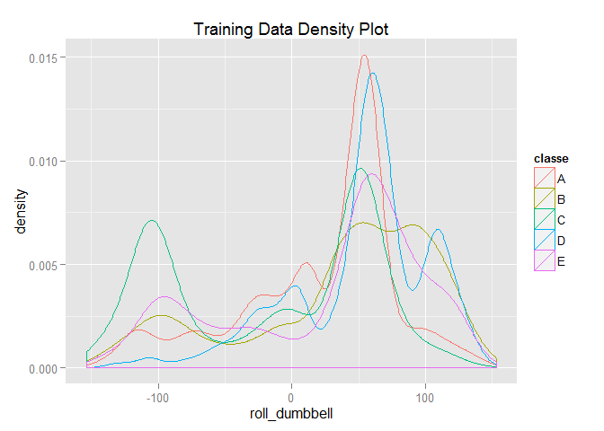
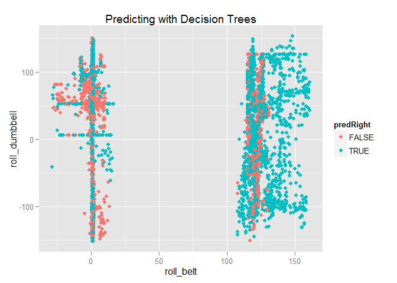
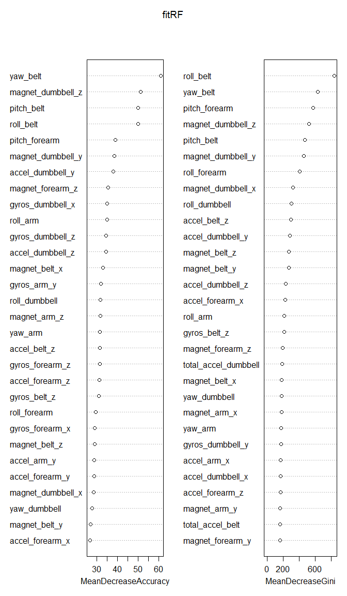
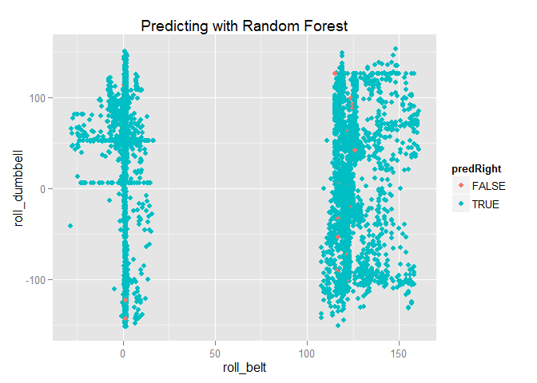

# Practical Machine Learning Course Project
FP  
`r format(Sys.time(), '%B %d, %Y')`  


This project uses data from accelerometers on the belt, forearm, arm, and dumbell of 6 participants. They were asked to perform barbell lifts correctly and incorrectly in 5 different ways.   More information is available from the website here: http://groupware.les.inf.puc-rio.br/har (see the section on the Weight Lifting Exercise Dataset). 


### Describe how model was built 
Given limited time for this project, I've decided to exclude all columns with NA values and other not helpful non-numeric and near zero value columns.  The starting training data set has 53 variables including an outcome classe. I've then partion this data set 70/30% for training and testing.  The first prediction model was created using Decision Trees and the second model using the Random Forests. 

### Model Selection and Test Result
Although the Ranodom Forest model took much longer, I've selected this model for higher accuracy of 99.47% vs 73.15% for Decision Trees.   All 20 different test cases predicted using the Random Forests model submitted had "correct" feedbacks.
 

### Load Libraries

```r
library(caret)
library(rpart)
library(randomForest)
library(ggplot2)
```

### Load Data

```r
pmlTrain <- read.csv("pml-training.csv", na.strings=c("NA", "", "#DIV/0!"), stringsAsFactors=FALSE)
pmlTest <- read.csv("pml-testing.csv", na.strings=c("NA", "", "#DIV/0!"), stringsAsFactors=FALSE)
colNames <- colnames(pmlTrain)
```


### pre-process training set

```r
# find columns with NA
naSum <- apply(pmlTrain,2,function(x) cnt=sum(is.na(x)))
colNa <- naSum[naSum > 0]
colNaNames <- attr(colNa, "name")

# exclude first 7 not helpful columns
colExclude <- c(colNaNames,colNames[1:7])

# get columns to include in training set
colInclude <- setdiff(colNames, colExclude)

# build traing set
features <- subset(pmlTrain, select=c(colInclude))
features$classe <- as.factor(features$classe)
```


### Splitting data set by Trainining and Test Sets

```r
# partion training/test data 70/30 percent
set.seed(123)
inTrain <- createDataPartition(y=features$classe,
                               p=0.7, list=FALSE)
training <- features[inTrain,]
testing <- features[-inTrain,]

table(training$classe)
```

```
## 
##    A    B    C    D    E 
## 3906 2658 2396 2252 2525
```

### Remove any Near Zero Variance Variables

```r
nzv <- nearZeroVar(training, saveMetrics=TRUE)
training <- training[,nzv$nzv==FALSE]
qplot(roll_dumbbell, color=classe, data=training, geom="density", main="Training Data Density Plot")
```

 

### Train with Decision Trees 

```r
set.seed(123)
fitDT <- rpart(classe ~ ., data=training, method="class")
```

### Predict Testing Set with Decision Trees

```r
predDT <- predict(fitDT, testing, type="class")
confusionMatrix(predDT, testing$classe)
```

```
## Confusion Matrix and Statistics
## 
##           Reference
## Prediction    A    B    C    D    E
##          A 1424  184   52   56   25
##          B   26  667   54   48   70
##          C   33  107  701   53   52
##          D  167  106  193  735  157
##          E   24   75   26   72  778
## 
## Overall Statistics
##                                         
##                Accuracy : 0.7315        
##                  95% CI : (0.72, 0.7428)
##     No Information Rate : 0.2845        
##     P-Value [Acc > NIR] : < 2.2e-16     
##                                         
##                   Kappa : 0.6606        
##  Mcnemar's Test P-Value : < 2.2e-16     
## 
## Statistics by Class:
## 
##                      Class: A Class: B Class: C Class: D Class: E
## Sensitivity            0.8507   0.5856   0.6832   0.7624   0.7190
## Specificity            0.9247   0.9583   0.9496   0.8734   0.9590
## Pos Pred Value         0.8179   0.7711   0.7410   0.5412   0.7979
## Neg Pred Value         0.9397   0.9060   0.9342   0.9494   0.9381
## Prevalence             0.2845   0.1935   0.1743   0.1638   0.1839
## Detection Rate         0.2420   0.1133   0.1191   0.1249   0.1322
## Detection Prevalence   0.2958   0.1470   0.1607   0.2308   0.1657
## Balanced Accuracy      0.8877   0.7719   0.8164   0.8179   0.8390
```


### Predict roll_belt, roll_dumbbell with Decision Trees

```r
# create variable to use for ploting 
testing$predRight <- predDT == testing$classe
qplot(roll_belt, roll_dumbbell, color=predRight, data=testing, 
      main="Predicting with Decision Trees")
```

 

### Train with Random Forests

```r
# free memory, random forest is gobbling up memory and cpu
# rm(pmlTrain)

set.seed(123)
fitRF <- randomForest(classe ~., data=training, type="class", importance=TRUE)
summary(fitRF)
```

```
##                 Length Class  Mode     
## call                5  -none- call     
## type                1  -none- character
## predicted       13737  factor numeric  
## err.rate         3000  -none- numeric  
## confusion          30  -none- numeric  
## votes           68685  matrix numeric  
## oob.times       13737  -none- numeric  
## classes             5  -none- character
## importance        364  -none- numeric  
## importanceSD      312  -none- numeric  
## localImportance     0  -none- NULL     
## proximity           0  -none- NULL     
## ntree               1  -none- numeric  
## mtry                1  -none- numeric  
## forest             14  -none- list     
## y               13737  factor numeric  
## test                0  -none- NULL     
## inbag               0  -none- NULL     
## terms               3  terms  call
```

### Random Forest Cross-Validation

```r
# set.seed(123)
# cv <- rfcv(training[,1:52], training$classe)
# with(cv, plot(n.var, error.cv, log="x", type="o", lwd=2))
```


### Calculate Variable Importance

```r
varImpPlot(fitRF)
```

 


### Predict with Random Forests

```r
set.seed(123)
predRF <- predict(fitRF, testing, type="class")
confusionMatrix(predRF, testing$classe)
```

```
## Confusion Matrix and Statistics
## 
##           Reference
## Prediction    A    B    C    D    E
##          A 1673    5    0    0    0
##          B    1 1134   10    0    0
##          C    0    0 1015   13    0
##          D    0    0    1  950    0
##          E    0    0    0    1 1082
## 
## Overall Statistics
##                                           
##                Accuracy : 0.9947          
##                  95% CI : (0.9925, 0.9964)
##     No Information Rate : 0.2845          
##     P-Value [Acc > NIR] : < 2.2e-16       
##                                           
##                   Kappa : 0.9933          
##  Mcnemar's Test P-Value : NA              
## 
## Statistics by Class:
## 
##                      Class: A Class: B Class: C Class: D Class: E
## Sensitivity            0.9994   0.9956   0.9893   0.9855   1.0000
## Specificity            0.9988   0.9977   0.9973   0.9998   0.9998
## Pos Pred Value         0.9970   0.9904   0.9874   0.9989   0.9991
## Neg Pred Value         0.9998   0.9989   0.9977   0.9972   1.0000
## Prevalence             0.2845   0.1935   0.1743   0.1638   0.1839
## Detection Rate         0.2843   0.1927   0.1725   0.1614   0.1839
## Detection Prevalence   0.2851   0.1946   0.1747   0.1616   0.1840
## Balanced Accuracy      0.9991   0.9966   0.9933   0.9926   0.9999
```

### Predict roll_belt, roll_dumbbell with Random forests

```r
# create variable to use for ploting 
testing$predRight <- predRF == testing$classe
qplot(roll_belt, roll_dumbbell, color=predRight, data=testing, main="Predicting with Random Forest")
```

 

### Expected Out of Sample Error

```r
OutOfSampleErrorPercent <- round(sum(predRF != testing$classe)/length(predRF),4) * 100
paste0("Out Of Sample Error: ", OutOfSampleErrorPercent, "%")
```

```
## [1] "Out Of Sample Error: 0.53%"
```

### Part II - Prediction Result using the Random Forests Model

```r
answers <- predict(fitRF, pmlTest, type="class")
summary(answers)
```

```
## A B C D E 
## 7 8 1 1 3
```


```r
wd <- getwd()
#### write out to file
setwd("predictions")
pml_write_files(answers)

### reset work directory
setwd(wd)

#  code reuse
pml_write_files = function(x){
    n = length(x)
    
    for(i in 1:n){
        filename = paste0("problem_id_",i,".txt")
        write.table(x[i],file=filename,quote=FALSE,row.names=FALSE,col.names=FALSE)
    }
}
```
